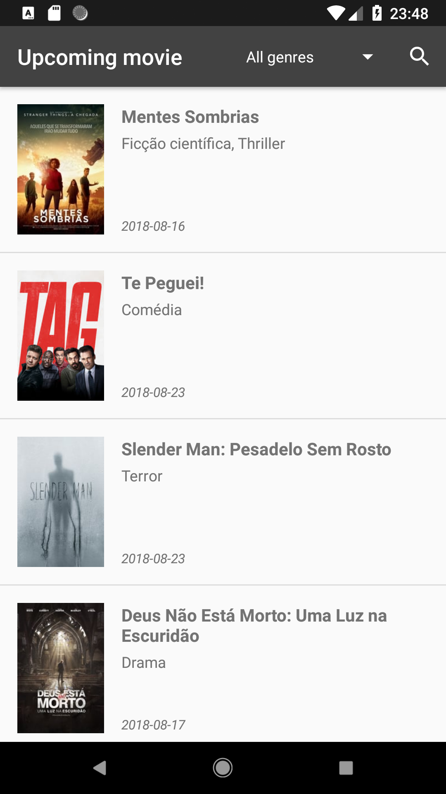

# upcoming-movies-mobile-app

This app was made to exercise my knowleges of Android development as well as develop new skills around it.

## About the app
This is a simple upcoming movies app which is possible to:
* See a list of upcoming movies
* See the details of a specific movie

## Development
The project was developed as follows:
* Used Trello to plan and execute project tasks. There it's possible to also see future features and known issues. [Link here](https://trello.com/b/O78Y8wLe/upcoming-movies-mobile-app-android);
* Developed using Kotlin language;
* Implemented MVVM architecture;
* Used Circle CI for Continuous Integration since the beginning of the project to prevent the introduction of code that could broke the build.

## Libraries
* Support library;
* ViewModel and LiveData;
* Retrofit;
* Glide.

## Screenshots

  
  

